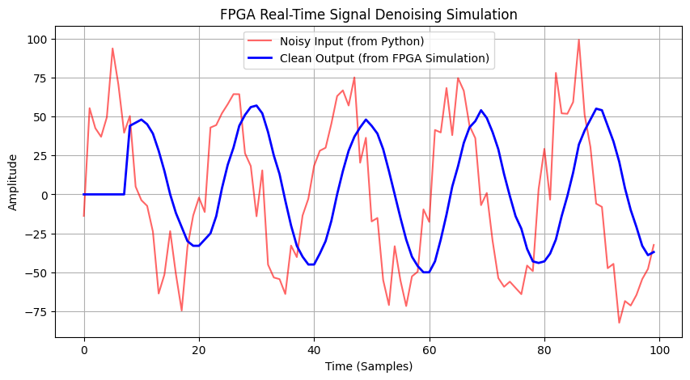

# FPGA-based Real-Time Signal Denoising (HIL Simulation)

## Project Overview
This project demonstrates a **Hardware-in-the-Loop (HIL)** approach to Digital Signal Processing. I designed an 8-tap Moving Average FIR filter in Verilog and built a Python-based verification environment to validate its performance against simulated noisy sensor data.

## Project Structure
- **/verilog**: Contains the RTL design (`design.sv`) and the File I/O testbench (`testbench.sv`).
- **/python**: Includes scripts for signal generation, hex formatting, and result visualization.
- **/Data**: Example hex files used to bridge the software and hardware domains.

## Technical Implementation
- **Filter Architecture**: 8-tap FIR Moving Average.
- **Optimization**: Utilized arithmetic right-shifts (`>>> 3`) for division to reduce FPGA resource utilization (avoiding expensive division IPs).
- **Latency**: Observed and validated a group delay of 3.5 samples, consistent with the theoretical $(N-1)/2$ formula.

## Results

*The blue line represents the hardware-filtered signal, showing significant noise reduction and the expected phase shift relative to the red input signal.*
